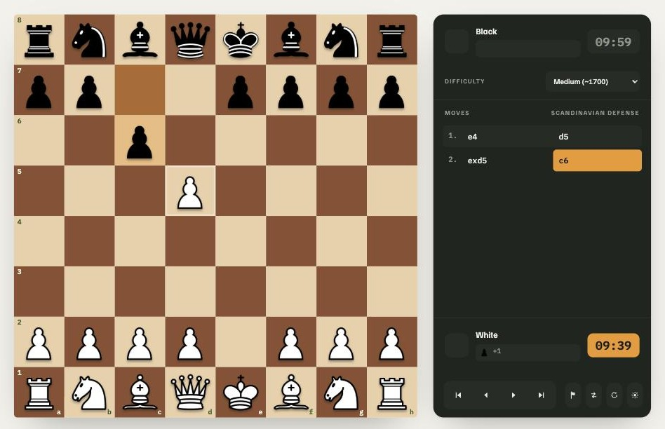

# World of Chess

A chess app built with React: play against a configurable AI opponent, browse the
history of World Chess Champions, and customize how the board and pieces look.
Available in English, Russian, and Armenian, with light and dark themes.



## Features

- **Play against the computer** — click, drag-and-drop, or full keyboard control
  (arrow keys move a cursor, Enter/Space selects and moves, modified arrows step
  through history, `f` flips the board). Choose your side, a time control from
  1 minute to 2 hours, and one of three difficulty levels before starting.
- **Three difficulty levels** — the engine is a minimax search with alpha-beta
  pruning and MVV-LVA move ordering, run as iterative deepening within a
  per-level time budget: Easy (no lookahead), Medium, and Hard (deeper search,
  bounded to stay responsive). See `src/components/Game/engine/ai.ts`.
  Real-time clocks, full move history with algebraic notation, captured-piece
  tracking, and board flipping are all part of the Play page.
- **World Champions** — a gallery of every undisputed World Chess Champion from
  Wilhelm Steinitz to the present, each linking out to their Wikipedia article.
- **Board customization** — five board color pairings and three piece styles
  (a classic set, plus two original minimal/bold sets), saved to your device.
- **Light and dark themes**, remembered across visits.
- **Internationalized** — English, Russian, and Armenian.

## Getting started

```bash
npm install
npm run dev      # start the dev server (Vite)
```

Other scripts:

```bash
npm test          # run the test suite once (Vitest)
npm run test:watch  # run tests in watch mode
npm run build      # production build
npm run preview     # preview the production build locally
```

## Tech stack

- [React 19](https://react.dev/) with [React Router](https://reactrouter.com/)
- [Vite](https://vitejs.dev/) for dev/build tooling
- TypeScript, adopted incrementally — the chess engine (`src/components/Game/engine`)
  and newer components are fully typed; some older UI components remain `.jsx`
- [Vitest](https://vitest.dev/) + [React Testing Library](https://testing-library.com/react)
- [react-i18next](https://react.i18next.com/) for translations

## Project structure

```text
src/
  components/
    Game/            # the Play page: board, panel, setup screen, and the AI engine
      engine/        # pieces, move rules, and the minimax AI -- no UI code
    BoardSettingsPage/
    ChampionsListPage/
    Header/
    HomePage/
  context/           # theme and board-settings React context providers
  i18n/translations/ # en / ru / am
docs/                # design specs and reference screenshots
```

## Design docs

`docs/PLAY-PAGE-SPEC.md` is the approved design spec the current Play page was
built against, with reference mockups in `docs/play-page-design/`.
